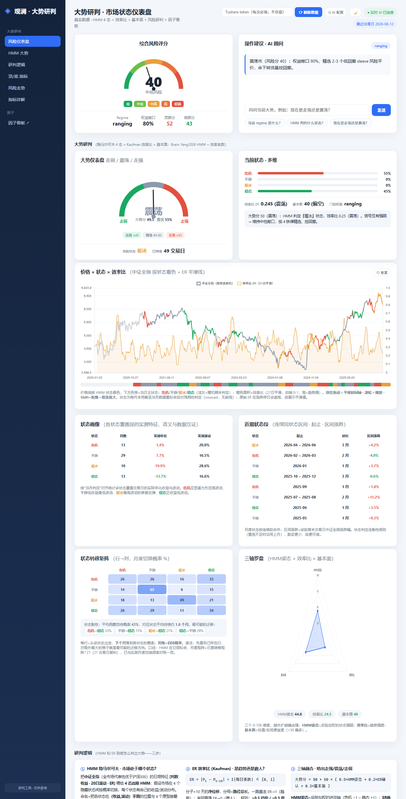
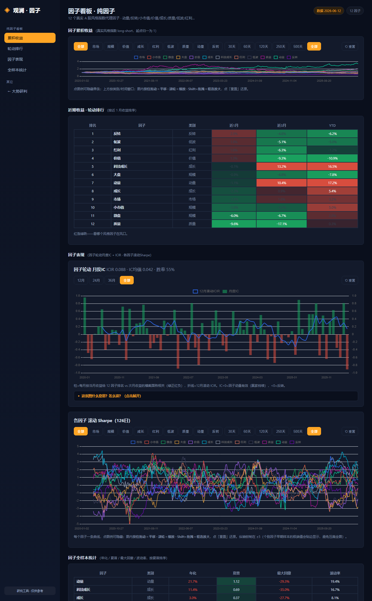

# 网页使用展示 — 观澜 · 大势研判 + 因子看板

> 配套阅读：上手命令见 [usage.md](usage.md)，agent/skill 调用见 [agent-使用说明.md](agent-使用说明.md)，
> 前后效果对比见 [before-after.md](before-after.md)。本文用**真实截图 + 当前真实读数**演示两页仪表板怎么看、怎么用。
> 截图为本仓库自带 `outputs/*.json`（最近交易日 **2026-06-12**）渲染，**无需任何 API key** 即可复现。

---

## 0. 怎么打开（30 秒，无密钥）

```powershell
python -m pip install -r requirements.txt        # 仅首次
python scripts\open_dashboard.py                  # 起服务 + 自动开浏览器（已在跑则直接打开）
#   或手动： python -m uvicorn server.app:app --port 8000   然后访问 http://localhost:8000
```
- **大势研判**（首页）：`http://localhost:8000/`
- **因子看板**：`http://localhost:8000/factors.html`（首页左侧导航「因子看板 ↗」也可跳转）

> Clone 下来直接开就能看——仓库已带演示数据。只有点「刷新数据」拉最新行情才需要 Tushare token，
> 且 token **每次输入、不落盘**（见 §1.2）。无 `ANTHROPIC_API_KEY` 时 AI 顾问降级为确定性基线建议，其余全部可用。

---

## 1. 第一页：大势研判 · 市场状态仪表盘



页面自上而下回答一个问题：**今天该进攻还是防御，凭什么？** 各面板与当前真实读数对应如下。

### 1.1 看图区（截图中可见）
| 面板 | 当前读数（2026-06-12） | 怎么读 |
|---|---|---|
| **综合风险评分**（左上仪表盘） | **39.8 ≈ 40 · 中低风险** | 0–100，越低越安全；下方「低/中低/中高/高/极端」五档带定位 |
| **大势研判**（HMM×ER×基本面 综合分） | **震荡 · 49.5 分**（confidence 55%） | 走强/震荡/走弱三态；分数越高越偏多 |
| **当前状态 · 多轴** | HMM **履冰** · 效率比 **ER 0.245**（10 日）· 基本面 | 三条轴各自投票，综合成上面的研判 |
| **价格 + 状态 + 效率比**（主图 + regime 色带） | 指数走势叠加 4 态色带 + ER 曲线 | 色带=每日 HMM 状态回溯（防前视：只用 `loc[:当日]`） |
| **状态画像 / 后验概率 / 状态转移矩阵** | 4 态的收益-波动画像、当日后验、转移概率 | 看当前最可能状态及它「黏不黏」（自留概率） |
| **三轴评分**（雷达） | HMM / ER / 基本面 三轴打分 | 一眼看哪条轴在主导研判 |
| **指标详解**（底部卡片） | HMM/ER/综合分的口径与公式 | 每个指标都给出定义，避免「黑箱分数」 |

> 当前组合读数：风险**中低**、大势**震荡**、HMM 处于**履冰**（偏谨慎过渡态）、ER 0.245 说明趋势效率不高
> → 对应**中性**姿态、权益敞口约 **0.8**。这是一份**研究读数**，不是交易信号。

### 1.2 顶栏操作（截图右上）
- **Tushare token 输入框** —「每次必填、不存盘」：粘贴 token → 点 **刷新数据**，后台重拉最新行情、按同一 walk-forward
  口径重算三张 JSON，并弹**5 段进度条**（拉数据 → regime → 大势 → 因子 → 落盘）。token 用完即从内存抹除，绝不写文件/日志。
- **AI 配置（⚙）** — 浏览器内切换 LLM 供应商：Anthropic 原生，或任意 OpenAI 兼容端点
  （DeepSeek / Moonshot / 智谱 / 通义 / 本地 Ollama）。填 key/base_url/model 即生效，**不绑定 Anthropic**。
- **最近交易日 2026-06-12** — 数据真实 asof，避免「看着是今天、其实是旧数据」。

### 1.3 AI 顾问（截图右上「研判 · AI 顾问」卡片）
基于当前 JSON 读数对话质询：「为什么是震荡不是走弱？」「履冰状态历史上后续怎么走？」
有 key 走实时流式（截图显示 **实时 AI 已连接**）；无 key 自动降级为**确定性基线建议**，措辞一致、可复现。

---

## 2. 第二页：因子看板 · 风格因子



12 个真实风格代理因子（反转/低波/红利/价值/成长/质量/规模…）的横截面研究。

| 面板 | 当前读数（2026-06-12） | 怎么读 |
|---|---|---|
| **因子累计净值** | 12 条风格因子净值曲线 | 长期谁强谁弱，一眼分层 |
| **因子排名（动量评分）** 热力表 | 近 1 月居前：**反转 +2.95% · 低波 +1.91% · 红利 +1.84%**；价值 +1.31% | 当月收益排名 → 次月倾斜的依据 |
| **因子月度 IC** | 信号「因子动量(当月→次月)」**IC 均值 0.042** | 柱状=每月 IC；正多负少则信号有效 |
| **滚动因子 Sharpe / ICIR** | **ICIR 0.088 · 胜率 54.5%** | 信号稳定性——**当前偏弱**（见 §3 诚实标注） |
| **因子贡献统计** | 各因子 1m/3m/YTD 收益与排名 | 拆解贡献来源 |

> 由此 `factor-allocation` 给出的当前姿态：**中性**；建议**超配 反转 / 低波 / 红利**，
> **低配 质量 / 微盘 / 小市值**。因 IC≈0.042 偏弱，倾斜仅作**弱倾斜**，不重仓押注。

---

## 3. 诚实标注（看图时请记住）

- **研究读数 ≠ 交易信号**：两页是「研判 + 配置建议」，**不构建组合、不回测**，故无夏普/收益类 PnL 数字。
- **因子动量当前很弱**：IC≈0.042、ICIR≈0.088、胜率 54.5%，仅略高于抛硬币 → 倾斜建议是弱信号，别当强 alpha。
- **ER 在涨跌停日会虚高**；样本外 regime 色带非全样本平滑（walk-forward 逐月重拟，边界会有跳变）。
- 截图为演示数据渲染；点「刷新数据」（需 token）后所有面板与上述读数会更新到最新交易日。

---

## 4. 如何复现这些截图

```powershell
python scripts\open_dashboard.py --no-browser      # 起服务（默认 8000）
# 用任意浏览器访问 http://localhost:8000 与 /factors.html 即得上图两页；
# 本文截图用 Edge 无头模式抓取，命令示例：
#   & "$env:ProgramFiles (x86)\Microsoft\Edge\Application\msedge.exe" `
#       --headless=new --window-size=1366,2680 --virtual-time-budget=9000 `
#       --screenshot=docs\img\dashboard-overview.png  http://localhost:8000/
```
> PDF 版本（含截图）：`python scripts\md_to_pdf.py docs\网页使用展示.md` → `docs/网页使用展示.pdf`。
